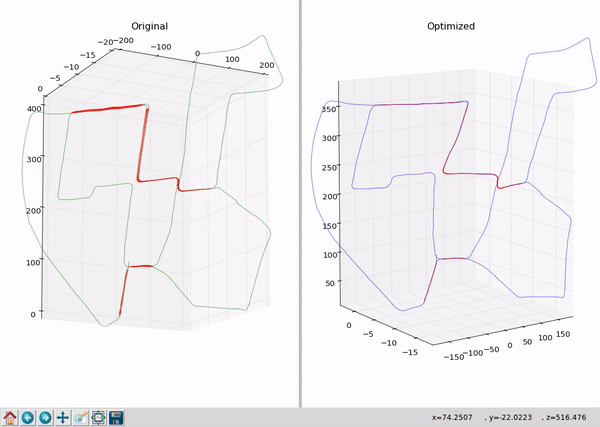
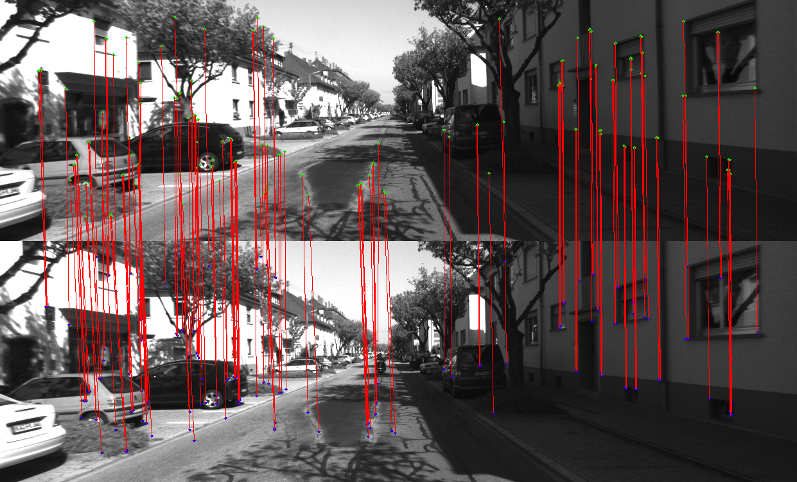
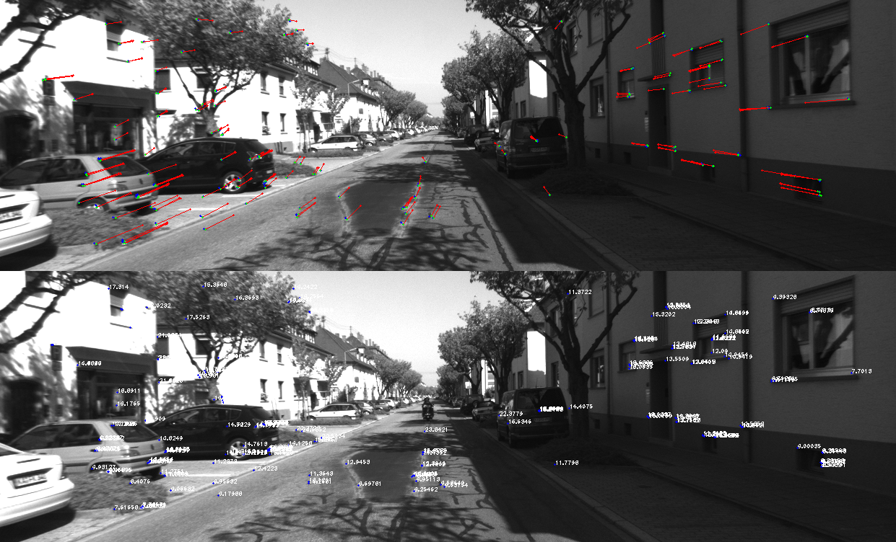
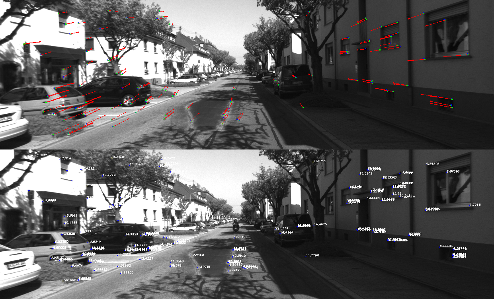
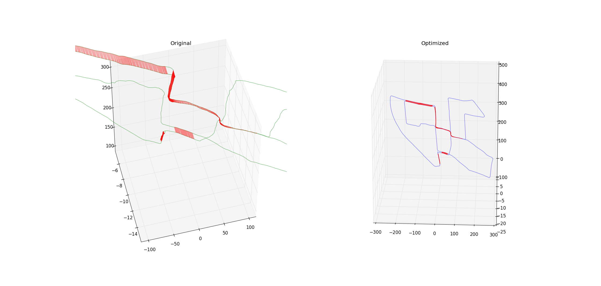
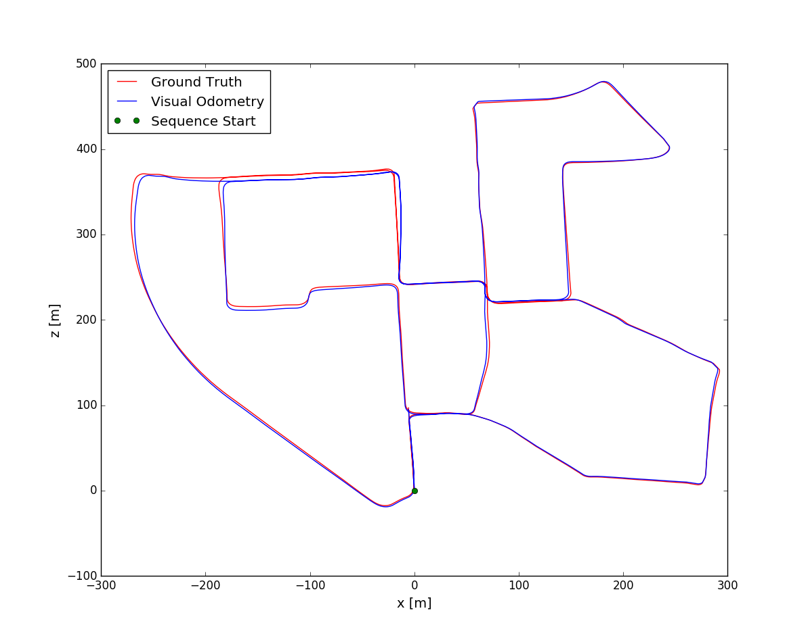

# A general tool for Pose Graph.

**Authors:** Xinliang Zhong. (xinliangzhong@foxmail.com)

# 1.Description
This is an **offline tool for Pose-Graph**. You will get an trajectory file (usually with x,y,z) after you have run the **SLAM** and **VO** algorithm. If the datasets contains a loop, This tool can optimize the pose and eliminate the cumulative error.

**Note:** This repo contains some other test files. All the useful file is [POSE_GRAPH_CERES_PLUS](https://github.com/TurtleZhong/PoseGraph-Ceres/tree/master/src/POSE_GRAPH_CERES_PLUS) folder.

**Videos:** [Youtube](https://youtu.be/ZyTNLuJWHx0), [Local Demo](src/POSE_GRAPH_CERES_PLUS/demo_video)

**Gif:**



# 2. Prerequisites
We have tested the library in **16.04**, but it should be easy to compile in other platforms.

## OpenCV
We use [OpenCV](http://opencv.org) to manipulate images and features. Dowload and install instructions can be found at: http://opencv.org. **Required at leat 2.4.3. Tested with OpenCV 2.4.11 and OpenCV 3.2**.

### Eigen3
Download and install instructions can be found at: http://eigen.tuxfamily.org. **Required at least 3.1.0**.

### Ceres
Download and install instructions can be found at: http://www.ceres-solver.org/installation.html.

# 3. How to build
```bash
mkdir build
cd build
cmake ..
make
```

# 4. How to run
#### All the executable files are in bin/ folder.
#### Then go the bin folder and run:

### generate_edges_from_trajectory_origion.cpp
###### Useage: ./motionestimate currentFrame.id lastFrame.id (eg:)
###### input: config/config.yaml
###### output: config/Edge_Candidates_index.txt
###### *Edge_Candidates_index.txt* Format

currentFrame.id lastFrame.id loopFrameCandidatesIndex.id... (eg:)
4477 4476 24 25 26 27 28

---
### motionestimate.cpp
###### Useage: ./motionestimate currentFrame.id lastFrame.id (eg:) KITTI sequence 00
./motionestimate 4477 28
you will see:
蓝色点为上一帧的keypoints 绿色点为当前帧的keypoints。
红色点为groundtruth投影到当前帧的点，红色连线是用groundtruth将上一帧2D点投影到当前帧与当前帧KeyPoints的连线，蓝色线为pnp或者ceres估计的位姿的连线。
##### Matches

##### Reprojection-ceres

##### Reprojection-pnp

---

### motionestimate_wholesequence.cpp
对整个序列做两帧之间的motionestimate

---

### pose_graph_ceres_plus.cpp
回环帧之间的T计算方式改变，首先pnp获得inliers，然后用本质矩阵E从inliers里边恢复R，然后固定R和3D点，只优化t.

---
### pose_graph_ceres_plus_final.cpp
从config/Edge_Candidates_index.txt中读取Edge，但务必记得先生成该文件，生成该文件的方式见**generate_edges_from_trajectory_origion.cpp**

---
### After you run the pose_graph_ceres*.cpp. 
##### You can get result in the result/ folder. And you can run ./*.sh or ./*.py to see some results! Please see [result/PlotShow/README](src/POSE_GRAPH_CERES_PLUS/result/PlotShow/README.md)

then you will get result in result/ folder.

---

# 5. Show the results

get into the result/PlotShow folder run:
./plot*.sh
then you will get:

and trajectory

# Good Luck to You!
